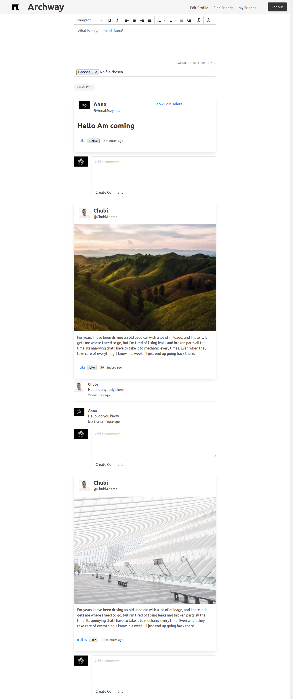

<br />
<p align="center">
  <h1 align="center">FACEBOOK CLONE</h1>

  <p align="center">
    A Ruby on Rails application
    <br />
    <br />
    <a href="https://calm-temple-12952.herokuapp.com/login">View Demo</a>
    ·
    <a href="https://github.com/kobiyoyo/FACEBOOK-CLONE/issues">Report Bug</a>
    ·
    <a href="https://github.com/kobiyoyo/FACEBOOK-CLONE/issues">Request Feature</a>
  </p>
  
</p>


## Description
The Facebook-clone project is an implementation of Facebook using Ruby on Rails. The technical goals of the project is to emulate some of the functionalities that Facebook has implemented, such as allowing the users to have friends in a symmetrical irreflexive way, accept & send friend requests, submit posts and see the posts of their friends and comment on the posts of their friends.

The project is part of a series of projects to be completed by students of [Microverse](https://www.microverse.org/ "The Global School for Remote Software Developers!").


## Technologies

- Ruby 
- Rails 
- Rspec
## Live Demo
[Live Demo Link](https://calm-temple-12952.herokuapp.com/login)
## Usage

> Clone the repository to your local machine

```sh
$ git clone https://github.com//danilozag1992/FACEBOOK-CLONE/.git
```

> cd into the directory

```sh
$ cd FACEBOOK-CLONE 
$ bundle install
$ rails db:migrate
```

> You can then drop into rails console to explore the models

```sh
$ cd rails c
```

## Contributors

* [Adama Chubiyojo Desmond](https://github.com/kobiyoyo)

* [Danilo Zagarcanin ](https://github.com/danilozag1992)

## Contributing

1. Fork it (https://github.com/danilozag1992/FACEBOOK-CLONE/fork)
2. Create your feature branch (git checkout -b feature/[choose-a-name])
3. Commit your changes (git commit -am 'what this commit will fix/add')
4. Push to the branch (git push origin feature/[chosen-name])
5. Create a new Pull Request

## License

This project is licensed under the MIT License - see the [LICENSE](./LICENSE) file for details
 


